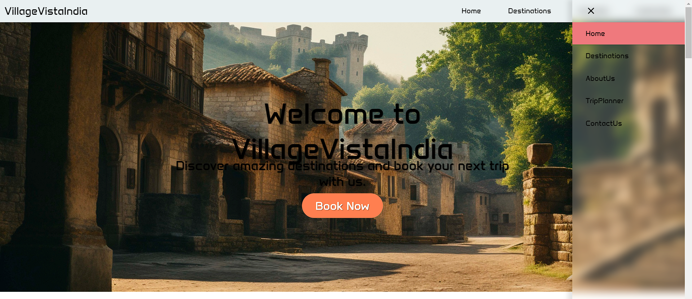

# Village Tourism Website Demo Project

## Introduction
Welcome to our demo project showcasing the vibrant tapestry of village tourism and culture. Explore the essence of rural life, cultural heritage, and local traditions in this immersive journey through picturesque villages and cultural landmarks.

## Features
- **Popular Destinations**: Discover fictional villages like Palampur, Ayirur, and Pragpur, each with its unique charm and attractions.
- **Featured Homestays**: Experience authentic village hospitality at our handpicked homestays, offering cozy accommodations and cultural experiences.
- **Cultural Corner**: Immerse yourself in local traditions and artistry with our curated selection of cultural activities and workshops.

## Screenshots

### Popular Destinations

### Featured Homestays

### Cultural Corner

## About Us
Learn more about our team and the inspiration behind this project.

## Usage
1. Clone the repository.
2. Open the `index.html` file in your web browser.
3. Explore the different sections of the website to discover village tourism and culture.

## Contributors
- John Doe
- Mandhata pathak
- David Lee

## License
This project is licensed under the MIT License - see the [LICENSE](LICENSE) file for details.

